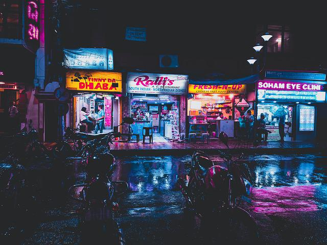
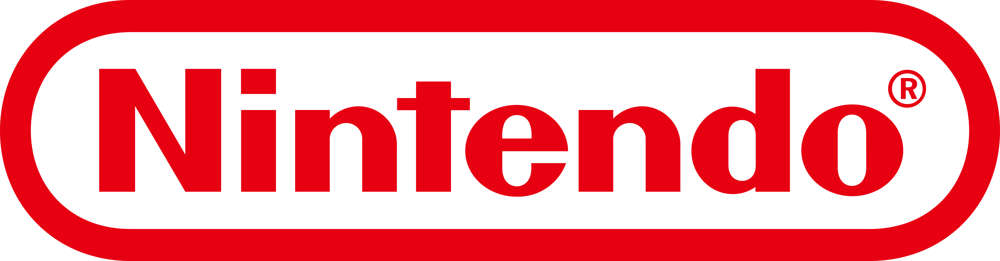

# games-shop-PRJ
Projeto de web page de uma loja de venda de jogos utilizando HTML e CSS, com o objetivo de aplicar conceitos de design responsivo, incluindo a utilização de Flexbox para criar um layout flexível e adaptável. Em sua maioria o código foi documentado para explicar as etapas de forma mais didática. O resultado da página pode ser visto clicando aqui: 

## Índice

- [1 - Header (cabeçalho)](#1---header-cabeçalho)
  - [Objetivos](#objetivos)
  - [Etapas](#etapas)
    - [Criação do header (HTML)](#criação-do-header-html)
    - [Estilização do header (CSS)](#estilização-do-header-css)

- [2 - About (sobre)](#2---about-sobre)
  - [Objetivos](#objetivos-1)
  - [Etapas](#etapas-1)
    - [Criação do about e importação de fontes (HTML)](#criação-do-about-e-importação-de-fontes-html)
    - [Estilização do about (CSS)](#estilização-do-about-css)

- [3 - Formulário e Footer (rodapé)](#3---formulário-e-footer-rodapé)
  - [Objetivos](#objetivos-2)
  - [Etapas](#etapas-2)
    - [Criação do Formulário de Contato (HTML)](#criação-do-formulário-de-contato-html)
    - [Estilização do Formulário (CSS)](#estilização-do-formulário-css)
    - [Criação e estilização do footer (HTML/CSS)](#criação-e-estilização-do-footer-htmlcss)
    - [Demais alterações (HTML)](#demais-alterações-html)


## 1 - Header (cabeçalho)
### Objetivos:
- Compreender os elementos principais que compõem o cabeçalho de um site, incluindo o logotipo da loja, o menu de navegação e seus respectivos links; aplicar estilos CSS para criar um cabeçalho visualmente atraente e funcional;
- Compreender os conceitos básicos de layout usando Flexbox.

### Etapas:
#### Criação do header (HTML):

```HTML
<!--`html:5` para criar a estrutura básica do projeto-->

<!DOCTYPE html>

<html lang="pt-br"><!--alteração da linguagem para "pt-br"-->

<head>

    <meta charset="UTF-8">

    <meta name="viewport" content="width=device-width, initial-scale=1.0">

    <title>Games Shop - A sua loja de games</title><!--alteração do título da aba da página-->

    <link rel="stylesheet" href="./main.css"/>

</head>

<body>

    <header>

        <div class="container"><!--`.container` para controle geral do header-->

            <h1>Games Shop</h1>

        <nav><!--elemento semântico informando que o conteúdo são links de navegação-->

            <ul><!--lista não ordenada-->

                <li><!--item da lista-->

                    <a href="#">Sobre a loja</a>

                </li>

                <li><!--item da lista-->

                    <a href="#">Contato</a>

                </li>

            </ul>

        </nav>

        </div>

    </header>

</body>

</html>
```

#### Estilização do header (CSS):

```CSS
/*removendo estilos padrão*/

* {

    margin: 0; /*removendo espaço externo padrão*/

    padding: 0; /*removendo espaço interno padrão*/

    box-sizing: border-box; /*removendo cálculo padrão*/

}

/*alteração do cabeçalho*/

header {

    padding: 16px 0;

    background-color: #182C61;

    color: #ecf0f1

}

/*alteração das listas de navegação*/

header nav li {

    display: inline; /*links lado a lado*/

    margin-left: 16px; /*margem esquerda para afastar os links*/

    font-size: 24px; /*aumenta o tamanho da fonte dos links*/

}

/*alteração da cor das listas de navegação*/

header nav li a{

    color: #ecf0f1; /*a cor só pode ser alterada na ancora <a>*/

    text-decoration: none; /*retira o sublinhado*/

}

/*criação de container para controlar o conteudo do header*/

.container {

    max-width: 1280px;

    width: 100%; /*estilo vai ocupar 100% da largura até chegar em 1288px*/

    margin: 0 auto; /*centraliza o texto com aumento da tela automaticamente*/

}

header .container {

    display:flex; /*coloca os links ao lado do título da página*/

    align-items: center; /*centraliza os links em relação a altura do título da página*/

    justify-content: space-between; /*coloca espaço máximo entre titulo e links*/

}
```

## 2 - About (sobre)
### Objetivos:
- Compreender a importância de criar seções bem estruturadas em uma página da web e como usar as tags semânticas HTML para definir a estrutura do conteúdo;
- Posicionar imagens e texto lado a lado, aplicar margens e espaçamentos para obter o espaçamento desejado entre os elementos e usar propriedades de fonte para estilizar o texto;
- Aprender a criar classes e IDs para segmentar elementos específicos no HTML e aplicar estilos apenas a esses elementos.

### Etapas:
#### Criação do about e importação de fontes (HTML):

```HTML
<!--código abaixo adicionado ao <head>-->

<!--importando as fontes Bungee e Lato-->

    <link rel="preconnect" href="https://fonts.googleapis.com">

    <link rel="preconnect" href="https://fonts.gstatic.com" crossorigin>

    <link href="https://fonts.googleapis.com/css2?family=Bungee&family=Lato:ital,wght@0,100;0,300;0,400;0,700;0,900;1,100;1,300;1,400;1,700;1,900&display=swap" rel="stylesheet">

<!--fim do código adicionado ao <head>-->

<!--código abaixo adicionado ao <body>-->

<!--criação da seção about/sobre-->
    <section>

        <div class="container">

            

            <div>

                <h2>Sobre a loja</h2><!--criação do about-->

                <p>

                    Lorem ipsum dolor sit amet consectetur adipisicing elit. Inventore ut veniam,
                    distinctio dolor eaque earum repudiandae voluptatibus iure quas blanditiis atque
                    molestias odit quibusdam ipsum vel aliquam? Quisquam, optio blanditiis.

                </p>

                <p>

                    Lorem ipsum dolor sit amet consectetur adipisicing elit. Inventore ut veniam,
                    distinctio dolor eaque earum repudiandae voluptatibus iure quas blanditiis atque
                    molestias odit quibusdam ipsum vel aliquam? Quisquam, optio blanditiis.

                </p>

                <ul class="brands-list"><!--criação da lista de logotipos das marcas-->

                    <li></li>

                    <li></li>

                    <li></li>

                </ul>

            </div>

        </div>

    </section>

<!--fim do código adicionado ao <body>-->
```

#### Estilização do about (CSS):

```CSS
/*início das adições/modificações do CSS*/

/*controle do tamanho dos logos das marcas*/

.brands-list img {

    height: 24px;

}

.brands-list li {

    display: inline; /*colocando as imagens dos logos das marcas lado a lado*/

    margin-right: 8px; /*espaçamento entre as imagens*/

}

/*controle do conteúdo do about*/

section .container {

    display: flex;

    align-items: flex-start; /* ajusta para o topo o texto em relação a altura do título da página*/

    justify-content: space-between;

}

/*adicionando espaçamento e cor padrão na section*/

section {

    padding: 24px 0;

    color: #182C61;

}

/*adicionando margem baixa no about*/

section h2 {

    margin-bottom: 16px;

}

/*adicionando margem baixa no parágrafo*/

section p {

    margin-bottom: 8px;

}

/*adicionando margem direita na imagem da loja*/

.store-front {

     margin-right: 32px;

}

/*regras para a fonte Bungee*/

.bungee-regular {

  font-family: "Bungee", sans-serif;

  font-weight: 400;

  font-style: normal;

}

/*regras para a fonte Lato*/

.lato-regular {

  font-family: "Lato", sans-serif;

  font-weight: 400;

  font-style: normal;

}

/*utilizando a fonte Bungee nos headers e h2*/

header,

section h2 {

    font-family: 'Bungee', cursive;

}

/*utilizando a fonte Lato no restante do corpo da página*/

body {

    font-family: 'Lato', sans-serif;

}

/*removendo o font-weigth padrão do navegador (bold)*/

header h1,

section h2 {

    font-weight: normal;

}

/*fim das adições/modificações do CSS*/
```

## 3 - Formulário e Footer (rodapé)
### Objetivos:
- criar uma seção de contato interativa em uma página da web;
- aplicar estilos de design à seção de contato usando CSS, incluindo a formatação de campos de entrada, botões e textos;
- criar um formulário de contato funcional, incluindo campos de entrada para nome, e-mail, telefone e mensagem.

### Etapas:
#### Criação do Formulário de Contato (HTML):

```HTML
<!--código abaixo adicionado ao <body>-->

<!--criação da seção do formulário de contato-->

<section id="contact">
    <div class="container">
        <h2>Contato</h2>
        <div class="contact-methods">
            <div>
                <h3>Fale conosco</h3>
                <form><!--criação do formulário de contato-->
                    <input type="text" placeholder="Seu nome" required />
                    <input type="email" placeholder="Seu e-mail" required />
                    <input type="tel" placeholder="Seu telefone" />
                    <textarea placeholder="Sua mensagem" required></textarea><!--caixa de mensagem-->
                    <button type="submit">Enviar</button><!--botão de envio de formulário-->
                </form>
            </div>

            <!--criação dos links das páginas sociais-->

            <div>
                <h3>Nos acompanhe</h3>
                <ul class="social-links">
                    <li>
                        <a href="#" title="Siga-nos no Instagram">
                            
                        </a>
                    </li>
                                        <li>
                        <a href="#" title="Siga-nos no Facebook">
                            
                        </a>
                    </li>
                                        <li>
                        <a href="#" title="Visite nosso canal no Youtube">
                            
                        </a>
                    </li>
                </ul>
            </div>

            <!--seção de endereço físico-->
            
            <div>
                <h3>Venha até nós</h3>
                <p>
                    Rua JavaScript nº 124, Vila HTML - Passo Fundo, RS
                </p>
            </div>
        </div>
    </div>
</section>

<!--fim do código adicionado ao <body>-->
```
#### Estilização do Formulário (CSS):

```CSS
/*início das adições/modificações do CSS*/

/*ajustando tamanho das imagens dos links das redes sociais*/
.social-links img {
    height: 24px;
}

/*ajustando lista das redes sociais aplicando margem e disposição lado-a-lado*/
.social-links li {
    display: inline;
    margin: 8px;
}

/*removendo underline padrão da tag <a>*/
.social-links li a {
    text-decoration: none;
}

/*display block para o formulário ocupar toda a largura*/
#contact .container {
    display: block;
}

/*aplicação de display flexível e espaçamento dos métodos de contato*/
.contact-methods {
    display: flex;
    justify-content: space-between;
}

/*definindo as características básicas do formulário*/
form input,
form textarea,
form button{
    display: block;
    width: 320px;
    margin-bottom: 8px;
    padding: 8px;
}

/*removendo o resize padrão da caixa "Sua mensagem" do formulário*/
form textarea {
    resize: none;
    height: 150px; /*aumentando altura da caixa de texto*/
}

/*aplicando fonte Bungee e removendo bold da seção h3*/
section h3 {
    font-family: 'Bungee', cursive;
    font-weight: normal;
    margin-bottom:  16px;
}

/*ajustando cor de fundo do botão "Enviar" do formulário*/
form button {
    background-color: #182C61;
    color: #ecf0f1;
    border: none;
    cursor: pointer /*aplicando mudança de cursor ao passar por cima do botão*/
}

/*aplicando efeito de mudança de cor ao passar o mouse no botão "Enviar"*/
form button:hover {
 background-color: #3458ba;

}

/*utilizando a fonte Lato no input e textarea*/
input,
textarea {
    font-family: 'Lato', sans-serif;
}

/*alteração da cor da borda no input e textarea utilizando a propriedade focus*/
input:focus, textarea:focus {
    outline-color: #182C61;
}

/*fim das adições/modificações do CSS*/
```
#### Criação e estilização do footer (HTML/CSS):

```HTML
<!--código abaixo adicionado ao <body>-->

<footer>
    <div class="container">
        <p>
            &copy; Games Shop - Todos os direitos reservados - 2026
        </p>
    </div>
</footer>

<!--fim do código adicionado ao <body>-->
```
```CSS

/*início das adições/modificações do CSS*/

footer { 
    background-color: #182C61;
    color: #ecf0f1;
    padding: 16px 0;
}

/*fim das adições/modificações do CSS*/
```

#### Demais alterações (HTML):

```HTML
<!--código abaixo alterado no <body>-->

<!--criação das âncoras para as seções-->

                <li>
                    <a href="#about">Sobre a loja</a>
                </li>
                <li>
                    <a href="#contact">Contato</a>
                </li>

<!--adição de texto nos parágrafos-->

<h2>Sobre a loja</h2>
                <p>
                    A Games Shop é o destino perfeito para quem busca mergulhar no universo dos videogames com qualidade e variedade. Nossa loja reúne o melhor do mundo Nintendo, PlayStation e Xbox, oferecendo desde consoles de última geração até uma seleção completa de jogos e acessórios. Aqui, cada gamer encontra aquilo que precisa para transformar sua experiência em algo único, seja explorando os clássicos da Nintendo, aproveitando os exclusivos da PlayStation ou vivenciando a potência dos títulos da Xbox. Trabalhamos para que cada visita seja uma jornada divertida, com atendimento especializado e produtos que atendem tanto iniciantes quanto jogadores experientes.
                </p>
                <p>
                    Além de oferecer os lançamentos mais aguardados, a Games Shop também valoriza a nostalgia e a diversidade, trazendo opções para quem gosta de revisitar franquias icônicas ou descobrir novos mundos. Nosso compromisso é proporcionar uma experiência completa: desde a compra segura e prática até o suporte pós-venda, garantindo que cada cliente tenha tranquilidade e satisfação. Seja para montar sua coleção, presentear alguém especial ou simplesmente se atualizar com as novidades do mercado gamer, a Games Shop é o lugar certo para quem respira jogos e quer estar sempre conectado às melhores plataformas.
                </p>

<!--fim das alterações no <body>-->
```


